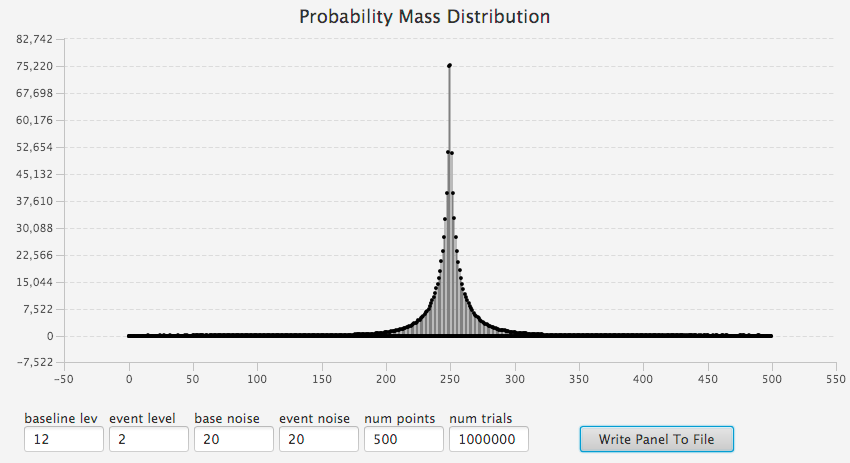
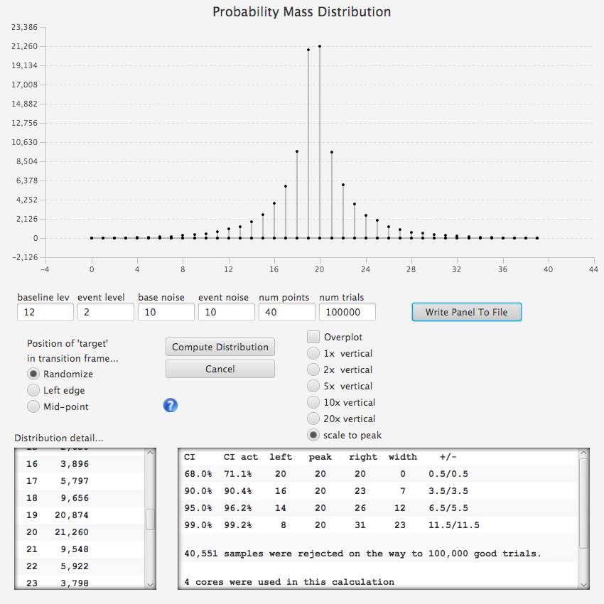

## Error Bar Study Panel

This panel provides a tool for experimenting with the monte carlo technique of error bar estimation that is used by Jocular when the observation noise exceeds the sub-frame timing regime --- that is, when there is no 'sub-frame band'[^1].

[^1]: See **Help | About**

## 

When an observation has a sub-frame band, then D and R timing errors have a gaussian distribution (`N[0,sigma]`) and the error bars can be calculated at any desired confidence level by the standard method of multiplying `sigma` by a factor. The factors used in Jocular are:

* 1.000000 for 68% confidence level
* 1.644854 for 90% confidence level
* 1.959964 for 95% confidence level
* 2.575829 for 99% confidence level

The factors above are shown to 6 decimal places simply so that their origin can be easily traced to standard tables. In the program, error bars are only reported to 2 decimal places, which is one more than needed usually.

## 

Once the noise environment pushes the observation outside the sub-frame timing regime, the error distributions become dramatically non-gaussian.  For example, at an SNR of 0.5, the error distribution looks like ...

Besides the sharp central peak, note that the distribution is 'discrete'.  Outside the sub-frame timing band, all solutions must be integer reading numbers (because there is no valid intermediate level from which a fractional reading number could be obtained). As a result, there is no continuous distribution function and error bars have to be determined by finding the smallest span of 'buckets' (commonly referred to as the Maximum Density Interval = MDI) that contains at least the desired percentage of trials. Additionally, this means that error bars themselves will be discrete: they will always be an integer number of readings wide. Finally, the MDI may end up containing more than the target percentage. This effect is small for low SNR observations, but will be quite noticeable for observations that are close to the sub-frame timing regime.

The above plot was obtained by 'solving' 1,000,000 sample observations containing only an R edge positioned randomly between the center of the sample and the previous reading. In this case, that means R randomly took on values between 249 and 250 during the 'trials'. (Note: it is also possible to run 'trials' where the R edge is fixed, but the random positioning fits 'reality' better and is the mode used when error bars are calculated in the main program.)

## The Dramatic Effect of Asymmetric Noise

When baseline and event noise are not equal, the distributions become rather skewed.  For example:

In this image, the previously mentioned effect where the MDI contains more than the target percentage is more evident, particularly at the 68% level.

## Asymmetric Noise --- A Small Mind Bender

The following plot was produced from the previous plot by **reducing** the baseline noise, keeping all other things the same. Note that the error bars **increased**.  This surprising result means that by adding noise to the baseline, the edge becomes more 'detectable'. But if one steps back (literally and figuratively), the effect is not so surprising. Stepping back and 'squinting' at an observation that has a noticeable difference in noise during the event simply makes event region stand out. The solution math produces the same effect by weighting points during the event more heavily than points in the baseline --- the same thing that your 'eye' does. 

 

## Sample Rejection, Detectability, and the `num points` parameter

The *detectability* of an edge event depends on how many observation points surround that edge. Any edge at any *drop* can be detected if enough observation points are included that bracket the edge.

Jocular's monte carlo algorithm includes a rejection criteria that is applied to each trial solution. The criteria for a good edge solution is that it's likelihood relative to a straight line solution (that is, no edge found) be at least 50. The exact value of this likelihood threshold is not important because increasing the number of samples in an observation can be always be done to meet any reasonable rejection criteria.

An alert message will be generated whenever the rejection rate is over 2% during a 'run'.  When this happens, increase the `num samples` parameter until the warnings go away.

The likelihood threshold criteria may also be viewed as an 'outlier' suppression procedure. By requiring an acceptance rate of at least 98%, it is reasonable to expect that the distribution curve has not been distorted by what is otherwise an ad hoc procedure. 

