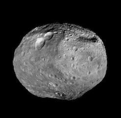

## Min and Max Mag Drop

These fields can be used to limit the 'search' to events (transition pairs) having magDrops constrained by the min and max values entered in these fields.

These fields have pre-defined default values.  Invalid values entered in either field will simply be ignored and replaced with the appropriate default value.

The maximum **Max Mag Drop** value is 1000.0 (the default value)

The minimum **Min Mag Drop** value is 0.01 (the default value)

It is an error to specify a min drop that is greater than the max drop.
